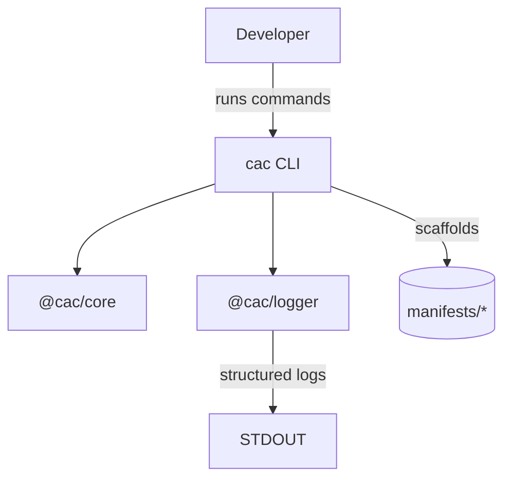

# Conductor as Code

 

## One-liner

Manage Netflix Conductor workflows as declarative code with a batteries-included TypeScript CLI.

## Architecture at a glance



## Table of Contents

- [Quickstart](#quickstart)
  - [Prerequisites](#prerequisites)
  - [One-shot setup](#one-shot-setup)
  - [First success criteria](#first-success-criteria)
- [Configuration](#configuration)
  - [Environment variables](#environment-variables)
  - [Secrets](#secrets)
- [Run & Develop](#run--develop)
  - [Local run (Node.js)](#local-run-nodejs)
  - [Docker / Compose](#docker--compose)
  - [Hot reload & DX tips](#hot-reload--dx-tips)
- [Testing & Quality](#testing--quality)
- [Architecture](#architecture)
  - [Repository layout](#repository-layout)
  - [Data flows and I/O](#data-flows-and-io)
  - [Known constraints](#known-constraints)
- [Observability](#observability)
- [CI/CD](#cicd)
- [Troubleshooting](#troubleshooting)
- [Security notes](#security-notes)
- [Roadmap / Next steps](#roadmap--next-steps)
- [Contributing](#contributing)
- [License & Contact](#license--contact)

## Quickstart

### Prerequisites

- Node.js 20 LTS or newer (ensures `tsup`/`tsx` target compatibility).
- pnpm 10.x (workspace-aware package manager).
- Git and a terminal (macOS/Linux shell or PowerShell on Windows).

### One-shot setup

```bash
# Clone
git clone https://github.com/your-org/conductor-as-code.git
cd conductor-as-code

# Install dependencies (uses workspace hoisting)
pnpm install

# Launch the CLI in dev mode and view available commands
pnpm dev -- --help
```

Windows (PowerShell): replace the last line with `pnpm dev -- --help` as well; pnpm handles the argument forwarding identically.

### First success criteria

```bash
# Scaffold the manifests tree in the current directory
pnpm dev -- init --force
```

Expected outcome within seconds:

- Log output similar to `Manifests scaffolded in <path>/manifests`.
- A `manifests/` directory with `tasks/`, `workflows/`, `event-handlers/`, `clients/`, and `environments/` subfolders populated with TODO sample files.

If you see `Manifest directory already exists`, rerun with `--force` or target an empty folder.

## Configuration

### Environment variables

| Name      | Required | Default | Description |
|-----------|----------|---------|-------------|
| `LOG_LEVEL` | No | `info` | Controls Pino log verbosity for the CLI and shared logger. Set to `debug` during troubleshooting. |

### Secrets

- No secrets are stored in the repository. Commands operate on local filesystem manifests only.
- For future remote Conductor integrations, prefer environment variables or your CI provider's encrypted secret store. Document any required keys in this section when added.

## Run & Develop

### Local run (Node.js)

| Mode | Command | Notes |
|------|---------|-------|
| Dev (TypeScript) | `pnpm dev -- [cli args]` | Runs the CLI via `tsx` without building; perfect for iteration. |
| Build | `pnpm build` | Executes the Turborepo build pipeline across packages and apps. |
| Package-local CLI | `pnpm --filter @cac/cli exec cac [command]` | Uses the compiled binary after `pnpm build`. |
| Lint | `pnpm lint` | Runs ESLint through Turbo for every package. |
| Format | `pnpm format` | Applies Prettier to supported file types. |

To run the built binary directly:

```bash
pnpm build
pnpm --filter @cac/cli exec cac init
```

### Docker / Compose

| Service | Ports | Purpose | Status |
|---------|-------|---------|--------|
| (TBD) CLI container | n/a | Containerized CLI for CI/CD or reproducible runs. | Planned – not implemented yet. |

No Dockerfiles or Compose manifests exist today. Run the CLI locally or in CI using Node.js + pnpm until container support lands.

### Hot reload & DX tips

- `pnpm dev -- --watch` enables `tsx` file watching for instant restarts when editing TypeScript sources.
- Pair with your editor's TypeScript and ESLint integrations for inline feedback.
- Husky runs `pnpm lint-staged` and `pnpm test` on every commit; keep commits focused to speed up hooks.

## Testing & Quality

| Scope | Command | Notes |
|-------|---------|-------|
| All tests | `pnpm test` | Aggregates package tests via Turborepo. |
| CLI unit tests | `pnpm --filter @cac/cli test` | Uses Vitest with Node environment. |
| Watch mode | `pnpm --filter @cac/cli test:watch` | Useful during development. |
| Coverage | `pnpm --filter @cac/cli test -- --coverage` | Generates coverage reports in `apps/cli/coverage/`. |

Quality gates:

- Commit messages follow Conventional Commits (enforced by Commitlint).
- Husky pre-commit hook blocks commits when lint or tests fail.
- No explicit coverage threshold yet—treat 80%+ lines/functions as the short-term goal.

## Architecture

### Repository layout

| Path | Description |
|------|-------------|
| `apps/cli` | Source for the `cac` command-line interface (commands, utilities, Vitest config). |
| `packages/core` | Shared constants and manifest scaffolding contracts. |
| `packages/logger` | Pino-based logger factory consumed by CLI and future packages. |
| `manifests/` | Example directory tree generated by `cac init`; safe playground for DSL files. |
| `turbo.json` | Turborepo pipeline definition for build/lint/test orchestration. |
| `pnpm-workspace.yaml` | Declares workspace packages for pnpm. |

### Data flows and I/O

- **Input:** CLI flags and arguments (`cac init`, `--force`, etc.).
- **Output:**
  - Structured logs to `stdout`/`stderr` via `@cac/logger` (Pino).
  - Filesystem side effects limited to creating directories/files under `<target>/manifests/`.
- **APIs:** No external API calls yet; future commands will integrate with the Conductor REST API.

### Known constraints

- Only the `init` command is implemented today—no diff/apply/rollback yet.
- File operations assume local POSIX-like semantics; Windows is supported but network mounts may require elevated permissions.
- Manifests are generated as placeholders; schema validation against Conductor contracts is pending.

## Observability

- Logging is handled by Pino. Increase verbosity by exporting `LOG_LEVEL=debug` before running the CLI.
- Structured JSON logs can be piped into aggregators (e.g., `jq`, Elastic, Loki) when running in CI or container environments.
- Metrics and tracing are not wired yet; plan to integrate OpenTelemetry once API interactions exist.

## CI/CD

- Turborepo pipelines (`build`, `lint`, `test`) are ready for CI usage.
- Recommended CI flow: `pnpm install --frozen-lockfile` → `pnpm lint` → `pnpm test` → `pnpm build`.
- Artifact caching: enable pnpm store caching and Turborepo remote cache in your CI provider for faster builds.
- Releases: publish CLI artifacts by packaging the `dist/` output of `@cac/cli`; versioning should follow SemVer aligned with Conventional Commits.
- No CI provider configuration is committed yet—add GitHub Actions / GitLab CI scripts in `.github/` or `.gitlab-ci.yml` when ready.

## Troubleshooting

| Symptom | Cause | Fix |
|---------|-------|-----|
| `SyntaxError: Unexpected token ??` | Node version < 20 lacks modern syntax support. | Upgrade to Node 20 LTS or run via `nvm use 20`. |
| `ERR_PNPM_ADDING_TO_ROOT` warnings | Running pnpm outside workspace root. | Always run commands from the repo root (`conductor-as-code/`). |
| `Manifest directory already exists` error during `init` | Target folder already has scaffolds. | Pass `--force` or delete the existing `manifests/` directory. |
| `cac: command not found` after build | Binary not linked globally. | Use `pnpm --filter @cac/cli exec cac ...` or `pnpm link --global`. |
| `EACCES: permission denied` while scaffolding | Insufficient filesystem permissions. | Run in a writable directory or adjust permissions/ACLs. |
| Husky hook aborts commit | Lint/tests failing in staged files. | Run `pnpm lint` / `pnpm test`, fix issues, recommit. |
| Tests hang on Windows | File watchers locked by antivirus. | Disable real-time scanning for the repo or use `pnpm --filter @cac/cli test` (non-watch). |

## Security notes

- Keep secrets (API keys, tokens) out of manifests and source control; rely on environment variables or secret managers.
- Principle of least privilege: limit filesystem access when running the CLI in CI to directories that need scaffolding.
- Generate SBOMs (e.g., `pnpm audit --json`) before releases to monitor dependencies.
- Review manifests for sensitive data before committing—templates are public by default.

## Roadmap / Next steps

1. Implement `validate` and `diff` commands with Conductor schema checks.
2. Add remote Conductor API client with environment-specific configuration.
3. Provide Docker image + Compose definition for reproducible runs.
4. Wire GitHub Actions CI pipeline with caching and release automation.
5. Integrate manifest schema validation using Zod and JSON Schema export.

## Contributing

- Branch from `main`; keep branches short-lived and focused.
- Use Conventional Commits (`feat:`, `fix:`, `docs:`) to satisfy Commitlint.
- Run `pnpm format`, `pnpm lint`, and `pnpm test` before pushing.
- Ensure new commands include accompanying tests and documentation updates.
- Open a PR with:
  - Clear description of the change and rationale.
  - Checklist confirming tests/lint/docs are updated.
  - Request review from the relevant maintainers (CODEOWNERS not yet defined).

## License & Contact

- License: [MIT](./LICENSE) (ensure `LICENSE` file exists and matches package metadata).
- Contact: `contact@conductor-as-code.dev` for questions, ideas, or security disclosures.

---

TODO: Confirm repository clone URL (`https://github.com/your-org/conductor-as-code.git`), maintainer contact email (`contact@conductor-as-code.dev`), and add official CI/CD provider configuration when available.
